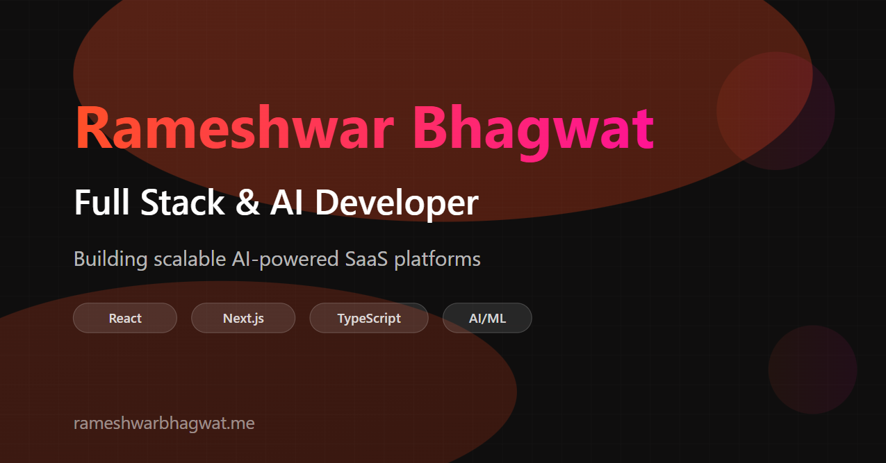

# Shriya Kulkarni — Portfolio

A personal portfolio website built with Next.js, showcasing projects, skills, and experience as a Full Stack Developer.

**Live:** [shriyakulkarni.vercel.app](https://shriyakulkarni.vercel.app)

---

## Preview



---

## About

This is my personal developer portfolio — built to present my projects, technical skills, and background in a clean, modern format. Designed to be fast, responsive, and easy to navigate across all devices.

---

## Features

- Animated hero section with smooth entrance transitions
- About section with profile card and timeline
- Scrolling marquee banner with developer tags
- Tech stack / skills grid
- Project showcase with hover effects
- GitHub contribution heatmap
- Resume download
- Contact form with email delivery
- Visitor counter (powered by Upstash Redis)
- Fully responsive across mobile, tablet, and desktop
- SEO optimized with structured data and Open Graph tags

---

## Tech Stack

| Category | Technologies |
|----------|-------------|
| Framework | Next.js 16, React 19 |
| Language | TypeScript |
| Styling | Tailwind CSS |
| Animations | Framer Motion |
| 3D / Graphics | Three.js, React Three Fiber |
| Forms | React Hook Form |
| Email | Nodemailer (SMTP) |
| Database | Upstash Redis (visitor counter) |
| Deployment | Vercel |

---

## Sections

| Section | Description |
|---------|-------------|
| Hero | Introduction with animated tagline and CTA buttons |
| About | Profile card, bio, and journey timeline |
| Skills | Tech stack grid — languages, frameworks, tools |
| Projects | Featured projects with live and GitHub links |
| GitHub Activity | Contribution heatmap from GitHub API |
| Resume | One-click resume download |
| Contact | Contact form with email notification |

---

## Projects Featured

- **Festify** — College event management platform with payments and role-based dashboards
- **FocusFlow** — Pomodoro productivity mobile app built with React Native
- **Personal Expense Tracker** — Full-stack expense management with analytics
- **AI Stationery Inventory** — AI-powered inventory tracking using Gemini API

---

## Getting Started

### Prerequisites

- Node.js 18+
- npm or yarn

### Installation

```bash
# Clone the repository
git clone https://github.com/Shriya-25/Portfolio.git

# Navigate into the project
cd Portfolio

# Install dependencies
npm install
```

### Environment Variables

Create a `.env.local` file in the root directory:

```env
# Email (for contact form)
SMTP_HOST=smtp.gmail.com
SMTP_PORT=587
SMTP_USER=your-email@gmail.com
SMTP_PASS=your-app-password
ADMIN_EMAIL=your-email@gmail.com

# Upstash Redis (for visitor counter)
UPSTASH_REDIS_REST_URL=your-upstash-url
UPSTASH_REDIS_REST_TOKEN=your-upstash-token

# Site URL
NEXT_PUBLIC_SITE_URL=https://shriyakulkarni.vercel.app
```

### Run Locally

```bash
npm run dev
```

Open [http://localhost:3000](http://localhost:3000) in your browser.

### Build for Production

```bash
npm run build
npm run start
```

---

## Folder Structure

```
src/
├── app/
│   ├── api/              # API routes (email, GitHub, visitors)
│   ├── layout.tsx        # Root layout with metadata
│   └── page.tsx          # Main page
├── components/
│   ├── layout/           # Navbar, Footer, Container
│   ├── sections/         # Hero, About, Skills, Work, GitHub, Resume, Contact
│   └── ui/               # Reusable UI components
├── lib/
│   └── constants.ts      # Site-wide constants and personal info
└── styles/               # Global styles and theme
public/
├── images/               # Project and profile images
├── resume/               # Resume PDF
└── favicon.ico
```

---

## Deployment

Deployed on [Vercel](https://vercel.com). To deploy your own:

1. Push the repository to GitHub
2. Import the project on [vercel.com](https://vercel.com)
3. Add the environment variables from `.env.local`
4. Deploy

---

## Contact

**Shriya Sandesh Kulkarni**
- Email: [shriya25.main@gmail.com](mailto:shriya25.main@gmail.com)
- GitHub: [github.com/Shriya-25](https://github.com/Shriya-25)
- LinkedIn: [linkedin.com/in/shriyakulkarni](https://linkedin.com/in/shriyakulkarni)
- Portfolio: [shriyakulkarni.vercel.app](https://shriyakulkarni.vercel.app)

---

## License

This project is open source and available under the [MIT License](LICENSE).
